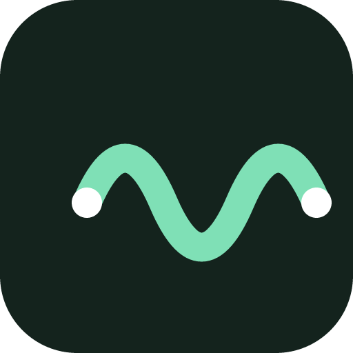
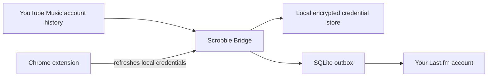

<p align="center">
  
</p>

<h1 align="center">Scrobble Bridge</h1>

<p align="center"><strong>YouTube Music → Last.fm · private, local-first scrobbling across your devices</strong></p>

<p align="center">
  <a href="https://github.com/o1xhack/Scrobble-Bridge/releases"></a>
  <a href="https://github.com/o1xhack/Scrobble-Bridge/releases"></a>
  <a href="https://github.com/o1xhack/Scrobble-Bridge/actions/workflows/ci.yml"></a>
  <a href="LICENSE"></a>
</p>

<p align="center">
  
  
  
  
</p>

<p align="center">🌐 <strong>English</strong> · <a href="docs/zh-CN/README.md">简体中文</a></p>

<p align="center">
  <a href="https://github.com/o1xhack/Scrobble-Bridge/releases/download/v1.0.0/Scrobble.Bridge_1.0.0_aarch64.dmg"><strong>Download for Apple silicon Mac →</strong></a>
  &nbsp;·&nbsp;
  <a href="https://github.com/o1xhack/Scrobble-Bridge/releases/tag/v1.0.0">All v1.0.0 downloads</a>
</p>

Scrobble Bridge keeps your YouTube Music listening history in sync with Last.fm. It can stay in the background on a Mac or Windows PC, or run continuously as a Docker service on a NAS. Once a play reaches the cloud history of the same YouTube Music account, Scrobble Bridge can discover it even if the music was played on a phone, tablet, TV, or another computer.

> **Platform status:** v1.0.0 has been runtime-tested only on an Apple silicon Mac. The Intel Mac build is packaged but has not been tested on Intel hardware. Windows and Docker/NAS builds are **Experimental** and have not received platform runtime testing. The Windows installer is unsigned.

> Scrobble Bridge is an independent project and is not affiliated with Google, YouTube, or Last.fm. YouTube Music does not provide the public history API this project needs. The current integration uses browser credentials with an internal web endpoint and may require maintenance when upstream behavior changes. Play times are inferred from history windows and should not be treated as an exact listening log.

## Download

| Platform               | Download                                                                                                                                             | Status                                          |
| ---------------------- | ---------------------------------------------------------------------------------------------------------------------------------------------------- | ----------------------------------------------- |
| Mac with Apple silicon | [DMG](https://github.com/o1xhack/Scrobble-Bridge/releases/download/v1.0.0/Scrobble.Bridge_1.0.0_aarch64.dmg)                                            | Recommended; runtime-tested on Apple silicon    |
| Intel Mac              | [DMG](https://github.com/o1xhack/Scrobble-Bridge/releases/download/v1.0.0/Scrobble.Bridge_1.0.0_x86_64.dmg)                                             | Beta; packaged but not tested on Intel hardware |
| Windows 10/11 x64      | [Experimental installer](https://github.com/o1xhack/Scrobble-Bridge/releases/download/v1.0.0/Scrobble.Bridge_1.0.0_x64-setup.exe)                       | Experimental; untested and unsigned             |

[Checksums and all v1.0.0 assets](https://github.com/o1xhack/Scrobble-Bridge/releases/tag/v1.0.0) are available on the release page. Do not download Scrobble Bridge from third-party mirrors.

### Install on macOS

1. Open the [Releases page](https://github.com/o1xhack/Scrobble-Bridge/releases) and download the DMG for your Mac.
2. Open the DMG and drag **Scrobble Bridge** to **Applications**.
3. Open Scrobble Bridge from Applications.
4. Install the Scrobble Bridge Chrome extension from its official Chrome Web Store listing when that listing is live.
5. Open YouTube Music in Chrome, then enable automatic credential refresh in the extension.
6. In the desktop app, choose **Authorize with Last.fm** and approve Scrobble Bridge in the browser. You do not need to enter an API key or shared secret.

Closing the main window leaves the background service running. Reopen it from the Dock/menu bar, or choose **Quit** to stop it completely.

### Software updates

The desktop App checks the signed GitHub Release update manifest once a day, including after a due check is recovered from sleep or the App returns to the foreground. When a newer version is available, a prominent home-screen banner shows the release notes. Scrobble Bridge does not silently download or install it: choose **Download update**, wait for signature verification, then choose **Update now and restart**. A manual **Check now** action and the last/next check times remain available in Settings.

### Install on Windows

> **Experimental:** the Windows build has not received runtime testing and the v1.0.0 installer is unsigned. Windows may show an unknown-publisher warning. Use it only if you are comfortable testing an early build.

1. Download the x64 setup executable from the [Releases page](https://github.com/o1xhack/Scrobble-Bridge/releases).
2. Run the per-user installer and launch Scrobble Bridge from the Start menu.
3. Install the official Chrome extension, connect YouTube Music, and authorize Last.fm in the desktop app.
4. Closing the window leaves Scrobble Bridge in the system tray; choose **Quit** from the tray menu to stop it.

### Chrome extension before the store listing

The public Chrome Web Store listing is the recommended installation path. Until its production ID is assigned and included in the desktop installers, the extension is available only for source/developer testing. Do not treat the store-upload ZIP as a general sideload package: Chrome assigns a different identity outside the store unless the development manifest is used.

For development, build the extension and load `apps/extension/dist` from `chrome://extensions`:

```bash
corepack enable
pnpm install --frozen-lockfile
pnpm --filter @scrobble-bridge/extension build
```

## Why Scrobble Bridge?

- **One setup for every playback device.** A background instance watches the cloud history of one YouTube Music account, so phone, tablet, TV, and browser plays can reach Last.fm without installing a scrobbler on each device.
- **No API keys for ordinary users.** Official desktop installers include the project-level Last.fm application. Each user authorizes only their own Last.fm session.
- **Local-first credentials.** macOS uses Keychain, Windows uses Credential Manager, and NAS credentials are encrypted at rest. Scrobble Bridge has no hosted account service or credential relay.
- **Crash-safe and duplicate-aware.** A durable SQLite outbox, retry policy, recent-track reconciliation, and deterministic fingerprints protect pending plays through restarts and transient failures.
- **Designed for long-running use.** Pause state survives restarts, sleep/wake triggers catch-up, expired authorization requires explicit recovery, and history gaps cannot permanently stop later synchronization.
- **Signed, user-controlled updates.** The App checks daily, verifies each updater artifact with the project update key, and installs only after the user chooses to download and restart.
- **Desktop or self-hosted.** Use a native app for the easiest setup or Docker on an always-on NAS.

## How it works



The Chrome extension requests YouTube access only after you explicitly enable automatic refresh. It sends a short-lived credential snapshot to the desktop app through Chrome Native Messaging, or to a paired NAS over a user-approved HTTPS origin. Cookies are never stored in the extension.

## Choose where to run it

| Mode                     | Status       | When Chrome is closed                                                            | Credential storage                                   |
| ------------------------ | ------------ | -------------------------------------------------------------------------------- | ---------------------------------------------------- |
| macOS desktop app        | Recommended  | Continues with the last valid snapshot; refreshes the next time Chrome opens     | Keychain                                             |
| Windows desktop app      | Experimental | Continues with the last valid snapshot; refreshes the next time Chrome opens     | Credential Manager                                   |
| Docker / NAS             | Experimental | Continues with the last valid snapshot; refreshes after the extension reconnects | `/data/credentials.enc`, ChaCha20-Poly1305 encrypted |

Chrome does not need to remain open. When the saved YouTube credential truly expires, Scrobble Bridge enters `needs_attention`; open Chrome, sign in to YouTube Music again, and let the extension refresh it. The project does not claim to provide a permanent Cookie.

## Included in 1.0

- Rust synchronization core with ordered history windows, baseline protection, gap handling, repeated-play support, and deterministic fingerprints.
- SQLite outbox with crash recovery, Last.fm recent-track checks, exponential backoff, and daily backup.
- Tauri 2 + Svelte desktop app for macOS 12+ and experimental Windows 10/11 x64 support, with English and Simplified Chinese UI, menu bar/system tray operation, launch at login, and sleep/wake recovery.
- Chrome Manifest V3 extension with opt-in minimal permissions, automatic YouTube Music account detection, multi-account safeguards, and English/Simplified Chinese UI.
- Native Messaging bridge with an exact extension-origin allowlist and operating-system credential storage.
- Last.fm browser authorization using the bundled application identity; source builds retain an advanced bring-your-own-application fallback.
- Experimental Docker/NAS runtime for `linux/amd64` and `linux/arm64`, with a non-root user, read-only root filesystem, health endpoints, persistent storage, and HTTPS device pairing.

See the [1.0 implementation status](docs/1.0-implementation-status.md), [1.0 QA report](docs/1.0-qa-report.md), and [product and technical architecture](docs/1.0-product-architecture-plan.md).

## Docker / NAS

```bash
git clone https://github.com/o1xhack/Scrobble-Bridge.git
cd Scrobble-Bridge
docker compose -f deploy/docker/compose.yaml up -d --build
docker compose -f deploy/docker/compose.yaml exec scrobble-bridge \
  sh -c 'cat /data/secrets/admin.token'
```

Open `http://NAS_ADDRESS:8787` to finish setup. Do not expose this HTTP port directly to the public internet. Chrome pairing requires a trusted HTTPS reverse proxy or Tailscale Serve. See [Docker / NAS deployment](docs/docker-nas.md).

## Build from source

Requirements: Rust 1.94.1, Node.js 24, pnpm 10.34.5, and the Tauri system dependencies for your platform.

```bash
corepack enable
pnpm install --frozen-lockfile
cargo test --workspace
pnpm check
pnpm test
pnpm build
```

Desktop bundles:

```bash
pnpm --filter @scrobble-bridge/desktop bundle:mac
# On Windows:
pnpm --filter @scrobble-bridge/desktop tauri build --bundles nsis \
  --config src-tauri/tauri.release.conf.json
```

Source builds do not contain the official Last.fm API key or shared secret. Without project-level build credentials, the app exposes an advanced form for connecting a Last.fm API application you control. Never commit API credentials, YouTube Cookies, or Last.fm sessions.

## Documentation

| Document                                                 | Purpose                                                     |
| -------------------------------------------------------- | ----------------------------------------------------------- |
| [Simplified Chinese README](docs/zh-CN/README.md)        | Chinese product overview, download, installation, and setup |
| [Extension and credential connection](docs/extension.md) | Desktop/NAS extension flow and permission boundaries        |
| [Docker / NAS deployment](docs/docker-nas.md)            | Self-hosted deployment and HTTPS pairing                    |
| [Privacy](PRIVACY.md)                                    | Data handling and network destinations                      |
| [Security policy](SECURITY.md)                           | Vulnerability reporting and supported versions              |
| [1.0 QA report](docs/1.0-qa-report.md)                   | Verified scenarios and remaining real-device tests          |

## Privacy, limitations, and API terms

Scrobble Bridge does not provide hosted accounts, cloud credential storage, analytics, or a subscription service. Diagnostic exports contain operational state rather than credential values.

The Last.fm shared secret embedded in a native installer can be extracted by a determined party and must not be treated as a server-side secret. The project monitors application-level failures and supports credential rotation. Last.fm's default API license is non-commercial; paid distribution, subscriptions, commercial services, or research use require separate permission from Last.fm.

## Contributing

See [CONTRIBUTING.md](CONTRIBUTING.md). Before opening a pull request, run:

```bash
pnpm check
pnpm test
pnpm build
cargo fmt --all --check
cargo test --workspace
cargo clippy --workspace --all-targets -- -D warnings
```

## License

[MIT](LICENSE). See [THIRD_PARTY_NOTICES.md](THIRD_PARTY_NOTICES.md) for third-party software notices.
