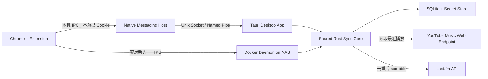

# Scrobble Bridge 1.0 产品与技术架构规划

- 文档状态：1.0 实施基线
- 日期：2026-08-13
- 公开仓库：`https://github.com/o1xhack/Scrobble-Bridge`
- 产品名：Scrobble Bridge
- 发布方式：开源源码 + macOS/Windows 安装包 + Chrome Web Store 扩展 + Docker 镜像

## 1. 结论

1.0 应做成一个**本地优先、无需厂商云服务器**的开源软件，包含三种交付物：

1. macOS 和 Windows 桌面 App；
2. 配套的 Chrome Extension；
3. 可在 NAS 上 24 小时运行的 Docker 镜像。

核心技术选型确定为：

- 桌面端：**Tauri 2 + Rust + Svelte/TypeScript + Vite**；
- 后台同步核心：Rust，共享给桌面端和 Docker；
- 本地状态：SQLite；
- 桌面密钥：macOS Keychain / Windows Credential Manager；
- 浏览器通信：桌面端使用 Chrome Native Messaging，NAS 使用显式配对的 HTTPS 接口；
- Chrome Extension：Manifest V3，事件驱动同步 Cookie 快照；
- Docker：Linux `amd64` + `arm64` 多架构镜像，适配常见 Intel/AMD 与 ARM NAS。

Chrome Extension 不负责“每隔几分钟 scrobble”。真正的定时任务由桌面 App 或 Docker 进程负责。Chrome 关闭后，后台仍使用最后一次同步成功的有效凭据继续运行；如果 Google 会话被登出、吊销或确实过期，则只能等待用户再次打开 Chrome 并重新登录/连接。任何扩展都无法在 Chrome 已退出时读取新的 Chrome Cookie，这是产品必须明确展示的边界。

## 2. 项目边界与仓库划分

本项目同时覆盖 macOS、Windows、Chrome Extension 和 Docker/NAS，因此使用独立的公开 GitHub 仓库。其他音乐来源或 Apple-only 产品可以借鉴 Last.fm 去重与提交经验，但不共享产品仓库、凭据或平台实现。

## 3. 1.0 范围

### 必须交付

- macOS 桌面 App：Apple Silicon 与 Intel；
- Windows 桌面 App：Windows 10 22H2+ / Windows 11，x64；
- 登录后自动启动、常驻 Menu Bar / System Tray；
- 窗口关闭时继续在后台运行，显式选择 Quit 才退出；
- 后台同步默认每 10 分钟检查一次；NAS 可配置同步间隔，最低 5 分钟；
- Chrome Extension 自动同步 YouTube Music 登录凭据；
- Chrome 关闭时继续使用现有凭据同步；
- Last.fm 授权、提交、失败重试和本地去重；
- Docker Compose 部署，支持 Linux `amd64` 和 `arm64` NAS；
- Docker Web 管理界面、健康检查、持久化卷和自动重启；
- 本地日志与诊断导出，自动脱敏；
- 开源源码、安装文档、隐私说明和非官方项目声明。

### 1.0 不做

- iOS / Android 客户端；
- Linux 桌面安装包；
- Firefox、Safari、Edge 的正式支持；
- 厂商托管的账号系统、Cookie 中转服务或付费 SaaS；
- 自动导入全部历史记录；
- 对历史播放时间精确到秒的承诺；
- 多用户 NAS 管理、团队权限系统；
- Apple Music、Spotify 等其他音乐源。

Windows ARM64 可在技术验证通过后追加原生包，但不作为 1.0 发布门槛；Windows x64 是 1.0 的正式 Windows 支持目标。

## 4. 为什么选择 Tauri，而不是 Electron

| 方案                | 结论   | 原因                                                                                                                  |
| ------------------- | ------ | --------------------------------------------------------------------------------------------------------------------- |
| Tauri 2             | 采用   | 使用系统 WebView，不随应用捆绑完整 Chromium；Rust 后台核心可直接复用于 Docker；支持 tray、autostart、安装包和签名流程 |
| Electron            | 不采用 | 每个应用捆绑 Chromium 和 Node.js，安装体积、内存和更新负担都更高                                                      |
| Flutter             | 不采用 | 桌面能力可行，但与 Rust 无界面 daemon 共享业务核心不如 Tauri 直接，插件与桌面托盘细节仍需额外平台桥接                 |
| Qt                  | 不采用 | 成熟但 UI 和打包工程更重，开源/商业许可与现代 Web UI 协作成本更高                                                     |
| 纯原生 Swift + .NET | 不采用 | 两套 UI 和系统集成代码，维护成本不适合 1.0                                                                            |

[Tauri 官方说明](https://tauri.app/start/)明确采用系统原生 WebView，而不是在每个应用中捆绑浏览器引擎。它也提供官方的 [System Tray](https://v2.tauri.app/learn/system-tray/) 与 [Autostart](https://v2.tauri.app/plugin/autostart/) 能力，符合本项目的后台常驻需求。

“体积小”作为需要实测的工程预算，而不是引用最小示例数字作为产品承诺：

- macOS universal DMG：目标不超过 30 MB；
- Windows 在线安装包：目标不超过 30 MB；
- 桌面空闲 RSS：目标中位数不超过 150 MB；
- Docker 压缩镜像：目标不超过 50 MB。

若加入 updater、双架构 macOS binary 或诊断组件后超出预算，必须在发布说明中给出实测值和原因。

## 5. 总体架构



全系统没有必需的项目方云服务。网络请求只发往用户选择的运行端、YouTube Music、Last.fm，以及用户主动开启时的版本更新源。

## 6. 仓库结构

采用 Cargo workspace + pnpm workspace：

```text
ytmusic-lastfm-scrobbler/
├── apps/
│   ├── desktop/              # Tauri shell、Menu Bar/System Tray、安装器
│   │   └── src-tauri/
│   ├── extension/            # Chrome Manifest V3 extension
│   └── web/                  # Docker 管理界面
├── packages/
│   └── ui/                   # Svelte UI、状态组件、transport abstraction
├── crates/
│   ├── core/                 # 领域模型、调度、匹配、去重、outbox
│   ├── ytmusic-client/       # 最小化 YouTube Music Web client
│   ├── lastfm-client/        # Last.fm 签名、授权、提交、查询
│   ├── daemon/               # 后台进程、HTTP/IPC、health endpoint
│   ├── storage/              # SQLite migrations 与 secret abstraction
│   └── native-host/          # Chrome Native Messaging 小型宿主
├── deploy/
│   └── docker/               # Dockerfile、compose、NAS 示例
├── fixtures/                 # 已脱敏的协议响应 fixture
├── docs/
├── Cargo.toml
└── pnpm-workspace.yaml
```

桌面 UI 与 Docker Web UI 共享视觉组件和状态模型，但使用不同 transport：桌面走 Tauri IPC，Docker Web UI 走本机/内网 HTTPS API。

## 7. 桌面 App 运行方式

### 生命周期

- 用户登录系统后自动启动，可在设置中关闭；
- 启动后创建后台 daemon，并显示 Menu Bar / System Tray 图标；
- 点击窗口关闭按钮只隐藏窗口，不停止同步；
- Tray 菜单提供：`Open`、`Sync Now`、`Pause`、`Diagnostics`、`Quit`；
- `Quit` 才真正停止 daemon；
- 电脑睡眠期间不运行，唤醒后立即补一次同步；
- 断网时保留任务并指数退避，网络恢复后自动重试；
- OS 登录前不运行。1.0 不安装 system service，避免权限、升级和卸载复杂度。

### 状态表达

- 绿色：最近一次同步成功；
- 黄色：暂时失败，正在重试；
- 红色：凭据失效或需要用户处理；
- 灰色：已暂停或尚未完成设置。

通知只用于需要重新登录、连续失败、长期未同步等可操作事件，正常同步不弹通知。

## 8. Chrome Extension 设计

### 它真正做什么

扩展不是替用户“刷新 Google 登录”，而是把 Chrome 当前已有的有效 Cookie **同步成凭据快照**。Google 是否续期 Cookie 由 Chrome 中的正常登录会话决定，扩展不能制造一个被吊销的新会话。

扩展使用 Manifest V3，并坚持最小权限。安装时不授予 YouTube 站点访问；只有用户主动点击“启用自动刷新”时，Chrome 才同时请求以下两项可选权限：

- `cookies`：读取指定 YouTube Music 域的 Cookie；
- `nativeMessaging`：发送给本机安装的桌面 App；
- 最小可运行 host permission：按需请求 `https://music.youtube.com/*` 与认证 Cookie 所属的父域 `https://youtube.com/*`。Chrome Cookies API 只返回扩展拥有 Cookie 所属域权限的数据，因此仅授权子域会隐藏 `.youtube.com` 认证 Cookie；不申请其他 YouTube 子域，也不注入 content script；
- 不申请 `<all_urls>`；
- 默认不使用 `webRequest`；
- 不注入网页 content script，除非多账号识别 Spike 证明无法通过 Cookie 与 API 响应完成。

[Chrome cookies API](https://developer.chrome.com/docs/extensions/reference/api/cookies)允许拥有 `cookies` 与相应 host permission 的扩展查询 Cookie 并接收变化事件；[Native Messaging](https://developer.chrome.com/docs/extensions/develop/concepts/native-messaging)是 Chrome 官方提供的扩展与本机应用通信方式。

### 触发时机

扩展在以下事件发送最新快照：

1. 用户首次点击“启用自动刷新”，并批准 Chrome 显示的精确权限；
2. Chrome 启动时；
3. `cookies.onChanged` 检测到相关 Cookie 变化后，经过 debounce；
4. 用户点击 `Refresh credentials`；
5. Chrome 正在运行时，每 6 小时做一次低频校验，防止漏掉事件。

扩展 service worker 是事件驱动的，不作为永久后台进程；真正的 5–10 分钟调度始终由 App/Container 执行。

### 桌面通信

```text
Extension → Chrome Native Messaging → native-host
          → Unix domain socket (macOS) / named pipe (Windows)
          → Desktop daemon → OS secret store
```

- 扩展内不长期保存原始 Cookie；
- native host 的 manifest 只允许正式 Chrome Web Store extension ID；
- daemon 不对局域网开放 TCP 端口；
- daemon 未运行时，native host 尝试后台启动 App 并重试一次；
- 正式安装器负责注册、升级和卸载 native host manifest；
- development 与 production 使用不同 extension ID 和 manifest。

### NAS 通信

Native Messaging 只能连接同一台电脑上的本机程序，不能直接连接 NAS。因此扩展提供第二种目标：`NAS / Docker`。

1. Docker Web UI 生成一次性配对码；
2. 用户在扩展中输入配对码或扫描二维码；
3. 扩展确认 NAS 的 HTTPS endpoint 和服务器指纹；
4. 配对成功后只保存可撤销的设备 token；
5. Cookie 快照通过 HTTPS 直接从浏览器发送到用户自己的 NAS；
6. 请求包含 nonce 与短时签名，服务端拒绝重放。

1.0 不提供项目方云端中转。推荐通过 NAS 自带反向代理的可信证书、Tailscale Serve 或用户已信任的局域网证书暴露该 endpoint。纯 HTTP 和忽略证书错误不进入正式方案。

## 9. Chrome 关闭时的确定行为

| 场景                                           | 结果                                                               |
| ---------------------------------------------- | ------------------------------------------------------------------ |
| Chrome 关闭，但最后的 Cookie 仍有效            | 桌面 App / Docker 按计划继续同步                                   |
| Chrome 关闭，电脑睡眠                          | 桌面任务暂停；唤醒后立即运行一次                                   |
| Chrome 关闭，Cookie 在后台被 Google 吊销或过期 | 同步失败并进入“需要重新连接”；无法在 Chrome 外生成新 Cookie        |
| 用户稍后打开 Chrome，且仍处于登录状态          | 扩展启动事件重新发送当前快照，后台自动恢复                         |
| 用户退出 Google 账号                           | 扩展同步登出变化；后台停止使用旧凭据并要求重新连接                 |
| NAS 运行、用户电脑关机                         | NAS 使用最后有效快照继续工作；真正失效后等待电脑和 Chrome 再次上线 |

因此，产品承诺是“Chrome 关闭时继续运行”，不是“Chrome 永远不需要再次打开”。

## 10. YouTube Music 数据源

YouTube Data API 的公开 `watchHistory` 已不可访问；官方修订记录说明该历史 playlist 无法通过 API 获取。因此 1.0 只能像现有工具一样调用 YouTube Music Web 客户端使用的内部 endpoint。这不是官方稳定 API。

实现策略：

- 在 Rust 中实现仅覆盖所需请求的最小 client，不把 Python/Node runtime 塞进桌面包；
- 根据当前 Cookie 动态生成 `SAPISIDHASH` authorization；
- 读取播放历史，保留 `videoId`、标题、艺人、专辑与列表顺序；
- 原始响应只在 opt-in diagnostics 中保存，且必须脱敏；
- 使用版本化、脱敏 fixture 做 parser contract tests；
- 内部 endpoint 或字段变化时，暂停提交而不是猜测并污染 Last.fm 历史。

开源项目 [ytmusicapi](https://github.com/sigma67/ytmusicapi)证明了浏览器认证和读取 history 的技术可行性，其 [browser authentication 文档](https://ytmusicapi.readthedocs.io/en/latest/setup/browser.html)也说明其工作方式依赖浏览器请求/Cookie。1.0 可以借鉴协议行为；若复制其代码，必须保留 MIT 许可和 attribution。

### 条款风险

YouTube [服务条款](https://www.youtube.com/t/terms)与 [Developer Policies](https://developers.google.com/youtube/terms/developer-policies)对自动访问和 scraping 有明确限制。开源、免费、本地运行并不会自动消除此风险。因此：

- 必须标明非官方、实验性项目；
- 不暗示 YouTube/Google 背书；
- 不做厂商云端集中抓取；
- 不收集用户 Cookie；
- 发布前把“是否接受基于内部 endpoint 的持续兼容与条款风险”列为产品所有者签字门槛；
- 若风险不可接受，停止该数据源，而不是把不适合实时 scrobble 的公开 Data API 包装成可行替代。

## 11. 同步、时间推断与防重复

### 调度

触发条件：

- daemon 启动；
- 默认每 10 分钟；
- 用户点击 `Sync Now`；
- 收到新的浏览器凭据；
- 电脑从睡眠恢复；
- 网络从离线恢复。

同一账号只允许一个同步任务执行。新触发合并到当前任务之后，不能并发提交。

### 初始化策略

首次连接只建立“从现在开始”的 baseline，不自动把可见的旧历史全部提交到 Last.fm。这是避免错误时间戳与大规模重复的安全默认值。历史导入可以在后续版本做成带预览和确认的单独功能。

### 顺序匹配

YouTube Music 历史通常只有相对时间文本，并且同一首歌可能连续播放。不能只用 `videoId` 做集合去重。

1. 将历史视为有顺序、允许重复的序列；
2. 用最近一次已确认的序列窗口与新窗口做重叠匹配；
3. 对重叠之后的新项目分配近似播放时间；
4. 每条事件建立本地 fingerprint：账号、`videoId`、规范化 artist/title、推断时间 bucket、邻接上下文；
5. 若找不到可信重叠，不批量猜测，转入 review/pause 状态；
6. 只有 Last.fm 确认接收后才推进提交 cursor。

### 时间推断

由于数据源没有可靠的精确播放时间，1.0 必须在 UI 和 README 中说明“播放时间为估算值”。算法使用抓取时间、列表相对顺序、曲长和上一次锚点生成单调时间序列，但不能声称还原真实秒数。

### Last.fm 去重与提交

- 提交前读取一段 Last.fm recent tracks；
- 用规范化后的 `artist + title + timestamp window` 交叉检查；
- 本地 SQLite outbox 记录 `pending / accepted / rejected / retryable`；
- 失败采用指数退避和 jitter；
- `track.scrobble` 每批最多 50 条；
- 不依赖服务端 idempotency key，因为 Last.fm 没有提供；
- permanent rejection 单独展示，不无限重试。

[Last.fm `track.scrobble`](https://www.last.fm/api/show/track.scrobble)要求 artist、track 和 timestamp，并支持每次最多 50 条。Last.fm API 对非商业使用通常不收费，但其 [API Terms](https://www.last.fm/api/tos)保留限流与商业使用约束；正式公开分发前应确认本项目的应用 key 使用方式和商业边界。

## 12. 凭据与本地数据

### 桌面端

- YouTube Music Cookie：macOS Keychain / Windows Credential Manager；
- Last.fm session key：同一 OS secret store；
- SQLite 只保存 secret reference、credential version、hash 和非敏感状态；
- 日志不得出现 Cookie、Authorization、session key、API secret、配对 token。

### Docker

- SQLite 与配置放在 `/data` named volume；
- credential blob 使用 application-level AEAD 加密；
- 优先从 Docker secret / `SCROBBLE_MASTER_KEY_FILE` 读取主密钥；
- 易用模式可在首次启动时生成 `/data/secrets/master.key` 并设为仅容器用户可读，但 UI 要提示与数据库一起安全备份；
- Container 使用非 root 用户、只读 root filesystem 和单独 tmpfs；
- diagnostics 导出前进行结构化脱敏，而不是依赖字符串替换。

建议的 SQLite 表：

```text
accounts
credential_versions
sync_runs
history_snapshots
play_candidates
scrobble_outbox
submitted_fingerprints
settings
diagnostic_events
```

默认只保留必要元数据。原始 YouTube 响应不进入长期数据库。

## 13. Docker / NAS 可行性结论

**可行，而且是非常适合 24 小时运行的正式部署形态。** 同步核心是 HTTP 请求、解析、SQLite 和定时任务，不依赖桌面 WebView，也不需要虚拟显示器。

正式镜像要求：

- 单一 image tag 同时发布 `linux/amd64` 与 `linux/arm64`；
- multi-stage build，最终镜像只保留 daemon、CA certificates 和必要资源；
- `restart: unless-stopped`；
- `/health/live` 与 `/health/ready`；
- `/data` named volume；
- 非 root 运行；
- graceful shutdown，SQLite WAL checkpoint；
- 每日自动备份状态数据库，保留最近 7 份；
- timezone 只用于显示，内部时间统一 UTC；
- Web UI 默认只绑定内网，不自动开放公网。

[Docker multi-platform builds](https://docs.docker.com/build/building/multi-platform/)支持在一个 image manifest 中发布多个 CPU 架构，[Docker volumes](https://docs.docker.com/engine/storage/volumes/)用于保存容器重建后仍需保留的数据库与配置。

目标 NAS：

- Synology Container Manager；
- QNAP Container Station；
- TrueNAS SCALE / 标准 Docker Compose 主机。

1.0 不支持 32-bit ARM (`arm/v7`)。发布前必须在真实 `amd64` NAS 和 `arm64` NAS 各完成至少 7 天 soak test。

## 14. Last.fm 应用认证决策

Last.fm 使用 app-level API key/secret，并为每位用户换取独立 session。公开桌面应用里的 app secret 无法被视为真正不可提取的服务器秘密，因此 1.0 采用明确区分官方发行与自建的方案：

- 公开源码、测试 fixture 和日志绝不包含项目所有者的正式 API secret；
- 官方桌面安装包可以通过 GitHub Actions secrets 注入项目级 API application，普通用户只需要批准自己的 Last.fm 账号授权；
- 自行构建的桌面版本与 Docker/NAS 保留自备 Last.fm API application（BYO key）的能力；
- 打包进入原生安装包的 app secret 可被提取，因此必须按可轮换、可撤销的应用凭据管理，而不是宣称它等同于服务器机密；
- Last.fm 官方说明 API 对任何人开放申请，但 API Terms 的无收费许可面向非商业用途，商业或研究用途必须预先联系 Last.fm；
- 正式公开分发前仍需确认桌面 App、Docker 和自托管说明满足 API Terms、署名与品牌要求；
- 不以混淆、隐藏 binary 内容或 MIT 开源许可代替服务条款许可。

## 15. 开源与发布策略

建议代码使用 MIT License，以降低自托管和贡献门槛；第三方代码与 fixture 的来源单独列入 `THIRD_PARTY_NOTICES.md`。开源许可只管代码使用，不代表用户获得绕过 YouTube 或 Last.fm 条款的许可。

发布渠道：

- GitHub Releases：源码、macOS DMG、Windows installer、checksums；
- Chrome Web Store：正式固定 extension ID；
- GHCR：Docker multi-arch image；
- 可选自动更新：必须使用签名 manifest，默认先提示再安装。

平台要求：

- macOS：Developer ID 签名、Hardened Runtime、notarization；
- Windows：NSIS installer、应用和 native host code signing；
- Windows WebView2：优先使用系统已有 runtime，安装包带小型 bootstrapper；
- extension：固定权限清单、隐私政策、数据使用披露和审核用测试账号/说明。

Chrome Web Store 将认证 Cookie 视为用户数据，即使数据仅在用户设备之间传递，也需要清晰披露。实现和商店文案必须遵守 [Chrome Web Store User Data Policy](https://developer.chrome.com/docs/webstore/program-policies/user-data-faq)与 [安全最佳实践](https://developer.chrome.com/docs/extensions/develop/security-privacy/stay-secure)。

## 16. 1.0 前必须完成的技术 Spike

以下不是悬而未决的架构选型，而是对已选方案的 release gate。每项都有明确通过标准。

| 编号 | Spike                                | 通过标准                                                                       | 失败后的处理                                             |
| ---- | ------------------------------------ | ------------------------------------------------------------------------------ | -------------------------------------------------------- |
| S1   | Chrome Cookie → Rust history request | macOS/Windows 各连续成功读取正确账号历史；Chrome 关闭 48 小时仍可运行          | 调整所需 Cookie/headers；不能稳定则停止 1.0              |
| S2   | Cookie 域和最小权限                  | 列出实际必需 Cookie 与 host permissions；无需 `<all_urls>`/`webRequest`        | 若权限扩大，重新做隐私评审和商店预审                     |
| S3   | 多 Chrome profile / 多 Google 账号   | 用户可明确看到并选择账号，错误账号不会提交                                     | 1.0 限制单 profile，并在 UI 明示                         |
| S4   | History parser 稳定性                | 英文/中文 locale、Brand Account、重复歌曲 fixture 全部通过                     | 版本化 parser，未知结构 hard stop                        |
| S5   | 顺序重叠与时间推断                   | 重复同歌、离线、睡眠、缺失窗口测试无重复提交；时间单调                         | 缩短间隔或在失去锚点时停止自动提交                       |
| S6   | Native Messaging 安装生命周期        | 安装、升级、卸载、App 未启动、Chrome 重启在两平台通过                          | 使用更小的独立 helper installer；不改为本地开放端口      |
| S7   | NAS HTTPS 配对                       | Synology/QNAP 或等价真实设备完成首次配对、撤销、证书轮换                       | 1.0 Docker 改为手动凭据导入并标记 extension pairing beta |
| S8   | Docker 多架构                        | `amd64`/`arm64` 均构建，通过 7 天 soak，无 DB 损坏                             | 暂停失败架构，不用模拟测试冒充支持                       |
| S9   | Chrome Web Store policy              | 隐私披露、最小权限和单用途审核可接受                                           | 提供开发者模式 sideload，但不得宣称商店已支持            |
| S10  | Last.fm app credential               | 官方构建支持项目级授权，源码和 NAS 保留 BYO key                                | 官方凭据未配置时回退 BYO key，并禁止宣称免配置           |
| S11  | 签名与 updater                       | macOS Gatekeeper、Windows SmartScreen 测试机安装；更新签名验证失败会 hard stop | 关闭自动更新，只发布手动下载                             |
| S12  | YouTube 条款/维护风险确认            | 产品所有者书面接受非官方 endpoint 风险                                         | 不公开发布该数据源                                       |

## 17. 实施状态

原先按时间拆分的阶段已转换为直接交付目标，不再使用周数估算代替完成度。Rust core、daemon、桌面 App、Chrome Extension、Docker/NAS、发布自动化与开源文档均已落到仓库；代码证据与尚需外部账号、证书或真实硬件完成的门禁，统一记录在 [`1.0-implementation-status.md`](1.0-implementation-status.md) 和 [`release-checklist.md`](release-checklist.md)。

外部门禁不会被误报为本地已完成：Apple notarization、Windows Authenticode、Chrome Web Store、真实 NAS soak 与服务条款接受必须分别取得真实结果。

## 18. 1.0 验收标准

只有同时满足以下条件才称为 1.0：

- macOS Apple Silicon、macOS Intel、Windows x64 三类真实机器安装通过；
- App 关闭窗口后，连续后台同步 24 小时；
- Chrome 退出后仍使用有效快照继续同步；
- Chrome 重新打开并发生凭据变化后自动恢复；
- 电脑睡眠/唤醒、断网/恢复均不产生重复 scrobble；
- 连续重复播放同一首歌可保留为多次合法播放；
- 无可信序列锚点时不会猜测性批量提交；
- 所有 credential 在日志、diagnostics、crash output 中均不可见；
- extension 权限与商店披露一致；
- Docker `amd64`/`arm64` 通过 7 天真实 NAS soak；
- Container 重建后数据保留，数据库备份可恢复；
- macOS notarization 与 Windows signed installer 验证通过；
- 公开 README 明示时间为估算值、数据源非官方、条款/失效风险和 Chrome 关闭边界。

## 19. 主要风险和降级策略

| 风险                                      | 等级 | 降级策略                                                            |
| ----------------------------------------- | ---- | ------------------------------------------------------------------- |
| YouTube Music 内部 endpoint 变化          | 高   | versioned parser + fixtures；未知结构立即暂停，不提交脏数据         |
| YouTube 条款不允许该使用方式              | 高   | 不做云端集中服务；产品所有者 no-go 时停止公开发布                   |
| Cookie 被吊销或账号退出                   | 中   | 显示 reconnect 状态；Chrome 下次启动自动重同步                      |
| 历史没有精确时间                          | 高   | 明示估算；从当前 baseline 开始；不做默认历史回填                    |
| Last.fm 无 idempotency key                | 中   | 本地 outbox + recent tracks cross-check + cursor only on acceptance |
| Chrome Web Store 拒绝                     | 中   | 保留可审核的最小权限；必要时提供 sideload，不虚假标记商店可用       |
| NAS 自签名证书体验复杂                    | 中   | 优先文档化 Tailscale Serve/可信反代；手动导入作为有限降级           |
| Windows/macOS 安装器注册 native host 出错 | 中   | 双平台 installer e2e；卸载时只删除本产品明确拥有的 manifest         |

## 20. 当前已确定、无需再反复选型的事项

- 项目独立于 AppleMusicScrobbleProbe；
- 1.0 同时做 macOS、Windows、Chrome Extension 和 Docker/NAS；
- 使用 Tauri 2，而不是 Electron；
- Rust core 同时驱动 desktop 与 Docker；
- Chrome Extension 只同步凭据，不承担 scheduler；
- Chrome 关闭后继续使用最后有效凭据，真正失效时等待重新打开；
- 桌面使用 Native Messaging，不开 localhost TCP server；
- NAS 使用显式配对的 HTTPS，不经项目方云服务；
- SQLite + outbox + Last.fm recent tracks 双层去重；
- 首次连接只从当前 baseline 开始，不默认回填旧历史；
- 公开开源，但不把开源等同于获得第三方平台授权；
- 先完成协议/条款/Last.fm credential Spike，再投入完整 UI。

## 21. 主要依据

- [Tauri: Build smaller, faster, and more secure desktop applications](https://tauri.app/start/)
- [Tauri System Tray](https://v2.tauri.app/learn/system-tray/)
- [Tauri Autostart plugin](https://v2.tauri.app/plugin/autostart/)
- [Tauri Windows installers](https://v2.tauri.app/distribute/windows-installer/)
- [Chrome cookies API](https://developer.chrome.com/docs/extensions/reference/api/cookies)
- [Chrome Native Messaging](https://developer.chrome.com/docs/extensions/develop/concepts/native-messaging)
- [Chrome Extension security guidance](https://developer.chrome.com/docs/extensions/develop/security-privacy/stay-secure)
- [Chrome Web Store user data FAQ](https://developer.chrome.com/docs/webstore/program-policies/user-data-faq)
- [Docker multi-platform builds](https://docs.docker.com/build/building/multi-platform/)
- [Docker volumes](https://docs.docker.com/engine/storage/volumes/)
- [Last.fm API](https://www.last.fm/api)
- [Last.fm track.scrobble](https://www.last.fm/api/show/track.scrobble)
- [Last.fm API Terms](https://www.last.fm/api/tos)
- [YouTube Data API revision history: watch history access removed](https://developers.google.com/youtube/v3/revision_history)
- [YouTube Terms of Service](https://www.youtube.com/t/terms)
- [YouTube API Services Developer Policies](https://developers.google.com/youtube/terms/developer-policies)
- [ytmusicapi project](https://github.com/sigma67/ytmusicapi)
- [ytmusicapi browser authentication](https://ytmusicapi.readthedocs.io/en/latest/setup/browser.html)
