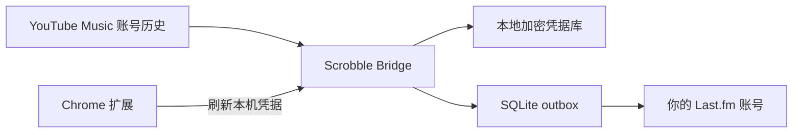

<p align="center">
  
</p>

<h1 align="center">Scrobble Bridge</h1>

<p align="center"><strong>YouTube Music → Last.fm · 隐私优先、本地运行的跨设备 Scrobbler</strong></p>

<p align="center">
  <a href="https://github.com/o1xhack/Scrobble-Bridge/releases"></a>
  <a href="https://github.com/o1xhack/Scrobble-Bridge/releases"></a>
  <a href="https://github.com/o1xhack/Scrobble-Bridge/actions/workflows/ci.yml"></a>
  <a href="../../LICENSE"></a>
</p>

<p align="center">
  
  
  
  
</p>

<p align="center">🌐 <a href="../../README.md">English</a> · <strong>简体中文</strong></p>

<p align="center">
  <a href="https://github.com/o1xhack/Scrobble-Bridge/releases"><strong>下载 macOS 或 Windows 版本 →</strong></a>
  &nbsp;·&nbsp;
  <a href="#dockernas">部署到 NAS</a>
</p>

Scrobble Bridge 把你的 YouTube Music 收听历史同步到 Last.fm。它可以在 Mac 或 Windows 电脑后台常驻，也可以在 NAS 上作为 Docker 服务持续运行。只要一次播放进入同一 YouTube Music 账号的云端历史，即使音乐来自手机、平板、电视或另一台电脑，Scrobble Bridge 也可以发现并同步。

> **发布状态：**开源 MVP 1.0 的代码和可复现构建工件已经完成，但首个公开二进制 GitHub Release 尚未发布。上面的永久下载入口会在剩余公开发布门禁获得授权后提供经过签名和公证的 v1.0.0 安装包。GitHub Actions 工件是测试工件，不等于公开 Release。

> Scrobble Bridge 是非官方独立项目，与 Google、YouTube 或 Last.fm 没有隶属或合作关系。YouTube Music 没有提供本项目所需的公开历史 API；当前实现使用浏览器凭据访问内部 Web endpoint，因此可能随上游变化而需要维护。播放时间根据历史窗口推算，不应当视为精确收听日志。

## 下载

Scrobble Bridge 通过 [GitHub Releases](https://github.com/o1xhack/Scrobble-Bridge/releases) 直接分发。macOS 版本**不需要**进入 Mac App Store，也不要求用户拥有 App Store 账号或购买记录。

| 平台              | 从最新 Release 下载                   | 公开分发门禁                                  |
| ----------------- | ------------------------------------- | --------------------------------------------- |
| Apple Silicon Mac | `Scrobble Bridge_1.0.0_aarch64.dmg`   | Developer ID 签名、Apple 公证、ticket stapled |
| Intel Mac         | `Scrobble Bridge_1.0.0_x86_64.dmg`    | Developer ID 签名、Apple 公证、ticket stapled |
| Windows 10/11 x64 | `Scrobble Bridge_1.0.0_x64-setup.exe` | Authenticode 签名有效                         |
| Chrome 扩展       | Chrome Web Store 页面                 | 正式扩展 ID 已写入桌面安装包允许列表          |

每个正式安装包旁边都会提供校验和。请不要从第三方镜像下载 Scrobble Bridge。

### 在 macOS 安装

1. 打开 [Releases 页面](https://github.com/o1xhack/Scrobble-Bridge/releases)，根据 Mac 芯片下载对应 DMG。
2. 打开 DMG，把 **Scrobble Bridge** 拖入 **Applications / 应用程序**。
3. 从应用程序目录打开 Scrobble Bridge。正式公开版本会使用 Developer ID 签名并通过 Apple 公证，适合站外直接分发。
4. Chrome Web Store 页面上线后，从官方页面安装 Scrobble Bridge 扩展。
5. 在 Chrome 打开 YouTube Music，然后在扩展里启用凭据自动刷新。
6. 在桌面 App 点击 **前往 Last.fm 授权**，在浏览器允许 Scrobble Bridge 访问。普通用户不需要填写 API Key 或 Shared Secret。

关闭主窗口后，后台同步服务仍会运行。可以从 Dock / 菜单栏重新打开；选择 **退出** 才会完全停止。

### 在 Windows 安装

1. 从 [Releases 页面](https://github.com/o1xhack/Scrobble-Bridge/releases) 下载 x64 安装程序。
2. 运行当前用户安装程序，从开始菜单启动 Scrobble Bridge。
3. 安装官方 Chrome 扩展，连接 YouTube Music，并在桌面 App 完成 Last.fm 授权。
4. 关闭窗口后 Scrobble Bridge 会留在系统托盘；从托盘菜单选择 **退出** 才会停止。

### Chrome 商店上线之前

Chrome Web Store 是面向普通用户的推荐安装路径。在正式扩展 ID 分配并写入桌面安装包之前，扩展只适合源码/开发测试。不要把用于 Chrome Web Store 的 ZIP 当作普通侧载安装包：如果不使用开发 manifest，Chrome 会在商店外为它分配不同的扩展身份。

开发测试可以构建扩展，然后在 `chrome://extensions` 加载 `apps/extension/dist`：

```bash
corepack enable
pnpm install --frozen-lockfile
pnpm --filter @scrobble-bridge/extension build
```

## 为什么使用 Scrobble Bridge？

- **一次配置，覆盖所有播放设备。**一个后台实例观察同一 YouTube Music 账号的云端历史；手机、平板、电视和浏览器播放都可以进入 Last.fm，不需要每台设备分别安装 Scrobbler。
- **普通用户不用申请 API Key。**官方桌面安装包包含项目级 Last.fm application，每位用户只授权自己的 Last.fm session。
- **凭据留在本机。**macOS 使用 Keychain，Windows 使用 Credential Manager，NAS 凭据经过静态加密。项目没有托管账号系统，也没有凭据中转服务器。
- **崩溃恢复与防重复。**持久化 SQLite outbox、退避重试、Recent Tracks 对账和确定性 fingerprint 能在重启和临时故障期间保护待提交播放。
- **适合长期后台运行。**暂停状态跨重启保留；睡眠唤醒后自动补跑；授权失效会要求明确恢复；一次历史间隙不会永久停止后续同步。
- **桌面与自托管两种方式。**普通用户使用原生 App，常开环境可以部署到 Docker / NAS。

## 工作原理



只有用户主动启用自动刷新后，Chrome 扩展才会请求 YouTube 访问权限。扩展通过 Chrome Native Messaging 把短期凭据快照交给桌面 App，或通过用户批准的 HTTPS origin 交给已配对 NAS；Cookie 不会写入扩展存储。

## 选择运行方式

| 方式         | 适合场景                            | Chrome 关闭后                                       | 凭据保存位置                                    |
| ------------ | ----------------------------------- | --------------------------------------------------- | ----------------------------------------------- |
| 桌面 App     | 日常使用的 Mac 或 Windows PC        | 使用最后一个有效快照继续同步；Chrome 下次打开后刷新 | Keychain / Credential Manager                   |
| Docker / NAS | Synology、QNAP、TrueNAS、家庭服务器 | 使用最后一个有效快照继续同步；扩展重新连接后刷新    | `/data/credentials.enc`，ChaCha20-Poly1305 加密 |

Chrome 不需要一直打开。保存的 YouTube 凭据真正失效后，Scrobble Bridge 会进入 `needs_attention`；重新打开 Chrome、登录 YouTube Music 并让扩展刷新即可。项目不会声称提供“永久 Cookie”。

## 1.0 包含什么

- Rust 同步核心：有序历史窗口、baseline 保护、间隙处理、重复播放和确定性 fingerprint。
- SQLite outbox：崩溃恢复、Last.fm Recent Tracks 对照、指数退避和每日备份。
- Tauri 2 + Svelte 桌面 App：macOS 12+、Windows 10/11 x64、英文/简体中文 UI、菜单栏/系统托盘、登录启动和睡眠唤醒恢复。
- Chrome Manifest V3 扩展：按需申请最小权限、自动识别 YouTube Music 账号、多账号保护和中英文 UI。
- Native Messaging：只允许精确扩展 origin，并使用操作系统凭据库。
- Last.fm 浏览器授权：官方安装包包含项目 application；源码构建保留高级自备 application 方式。
- Docker / NAS：`linux/amd64`、`linux/arm64`、非 root、只读根文件系统、健康检查、持久化数据和 HTTPS 设备配对。

实现详情见 [1.0 实施状态](../1.0-implementation-status.md)、[1.0 QA 报告](../1.0-qa-report.md)和[产品与技术架构](../1.0-product-architecture-plan.md)。

## Docker/NAS

```bash
git clone https://github.com/o1xhack/Scrobble-Bridge.git
cd Scrobble-Bridge
docker compose -f deploy/docker/compose.yaml up -d --build
docker compose -f deploy/docker/compose.yaml exec scrobble-bridge \
  sh -c 'cat /data/secrets/admin.token'
```

打开 `http://NAS_ADDRESS:8787` 完成设置。不要把这个 HTTP 端口直接暴露到公网；Chrome 配对必须使用可信 HTTPS reverse proxy 或 Tailscale Serve。完整说明见 [Docker / NAS 部署](../docker-nas.md)。

## 从源码构建

需要 Rust 1.94.1、Node.js 24、pnpm 10.34.5，以及对应平台的 Tauri 系统依赖。

```bash
corepack enable
pnpm install --frozen-lockfile
cargo test --workspace
pnpm check
pnpm test
pnpm build
```

桌面安装包：

```bash
pnpm --filter @scrobble-bridge/desktop bundle:mac
# 在 Windows：
pnpm --filter @scrobble-bridge/desktop tauri build --bundles nsis \
  --config src-tauri/tauri.release.conf.json
```

源码构建不会包含官方 Last.fm API Key 或 Shared Secret。如果没有提供项目级构建凭据，App 会显示高级表单，让开发者连接自己控制的 Last.fm API application。不要把 API 凭据、YouTube Cookie 或 Last.fm session 提交到 Git。

## 文档

| 文档                                                | 用途                           |
| --------------------------------------------------- | ------------------------------ |
| [English README](../../README.md)                   | 英文产品介绍、下载、安装和设置 |
| [扩展与凭据连接](../extension.md)                   | 桌面/NAS 扩展流程和权限边界    |
| [Docker / NAS 部署](../docker-nas.md)               | 自托管部署和 HTTPS 配对        |
| [隐私说明](../../PRIVACY.md)                        | 数据处理和网络目的地           |
| [安全策略](../../SECURITY.md)                       | 漏洞报告和受支持版本           |
| [Chrome Web Store 上架准备](../chrome-web-store.md) | 权限、商店文案和正式 ID 交接   |
| [1.0 QA 报告](../1.0-qa-report.md)                  | 已验证场景和剩余真机测试       |
| [发布清单](../release-checklist.md)                 | 签名、公证、真机 QA 和发布门禁 |

## 隐私、限制和 API 条款

Scrobble Bridge 不提供托管账号、云端凭据存储、分析统计或订阅服务。诊断导出只包含运行状态，不包含凭据值。

原生安装包内置的 Last.fm Shared Secret 可以被有能力的人提取，因此不能视为服务器端机密。项目需要监控 application 级故障并支持轮换。Last.fm API 默认只许可非商业用途；收费分发、订阅、商业服务或研究用途需要另行获得 Last.fm 授权。

## 参与贡献

请阅读 [CONTRIBUTING.md](../../CONTRIBUTING.md)。提交 Pull Request 前运行：

```bash
pnpm check
pnpm test
pnpm build
cargo fmt --all --check
cargo test --workspace
cargo clippy --workspace --all-targets -- -D warnings
```

## 许可证

[MIT](../../LICENSE)。第三方软件声明见 [THIRD_PARTY_NOTICES.md](../../THIRD_PARTY_NOTICES.md)。
